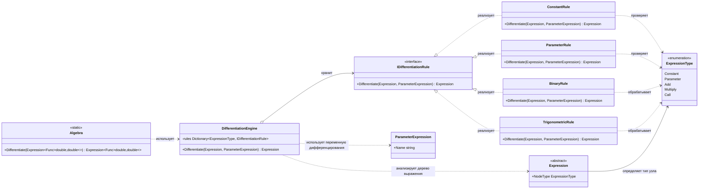

# Практика: Дифференцирование

## 1. Описание предметной области и сущностей
Программа вычисляет производные функций одной переменной, которые представлены в виде дерева выражений. Главный класс Algebra запускает процесс дифференцирования и передаёт работу классу DifferentiationEngine. Этот класс просматривает узлы дерева и выбирает нужное правило для вычисления производной : ConstantRule, ParameterRule, BinaryRule, TrigonometricRule. Такой подход позволяет легко расширять систему поддержкой новых математических операций и функций без изменения уже существующих компонентов.

## 2. Диаграмма классов (Mermaid)

