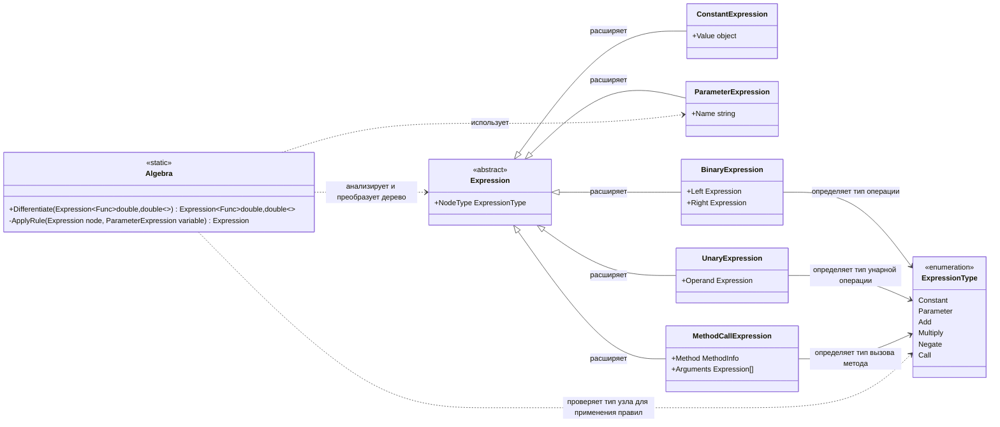

# Практика: Дифференцирование

## 1. Описание предметной области и сущностей
Программа вычисляет производные, представляя математические функции в виде деревьев из  класса Expression например, константы, переменные, бинарные операции. Главный класс Algebra отвечает за сам процесс дифференцирования: он проходит по этому дереву и применяет математические правила, создавая новое дерево-производную. Разделение на данные узлы дерева и логику класс Algebra делает код понятным и позволяет легко добавлять новые функции в будущем.

## 2. Диаграмма классов (Mermaid)

