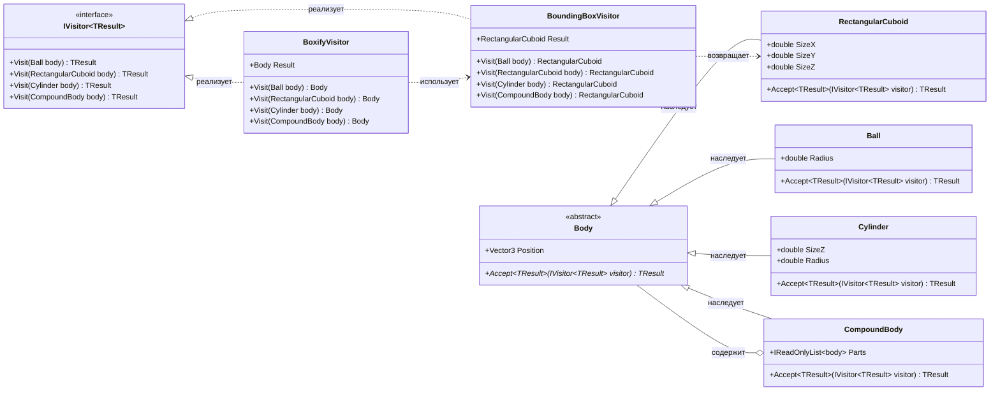

# Практика: Геометрия-2

## 1. Описание предметной области и сущностей
IVisitor<TResult> - интерфейс посетителя, который определяет методы Visit для каждого типа геометрического тела.

Body - абстрактный базовый класс который задает позицию геометрического тела в пространстве и содержит метод Accept для работы с посетителями.

Ball — шар наследник класса Body, у которого есть определенный радиус.

RectangularCuboid - прямоугольный параллелепипед наследник Body, который имеет размеры SizeX, SizeY, SizeZ.

Cylinder - цилиндр наследник Body, имеющий радиус основания и высоту.

CompoundBody - составное тело наследник Body, который содержит в себе список других геометрических тел.

BoundingBoxVisitor - посетитель, который вычисляет минимальный ограничивающий параллелепипед для любых фигур.

BoxifyVisitor - посетитель, который заменяет каждую простую фигуру на её ограничивающий параллелепипед при этом полностью сохраняя структуру составных тел.

## 2. Диаграмма классов (Mermaid)

