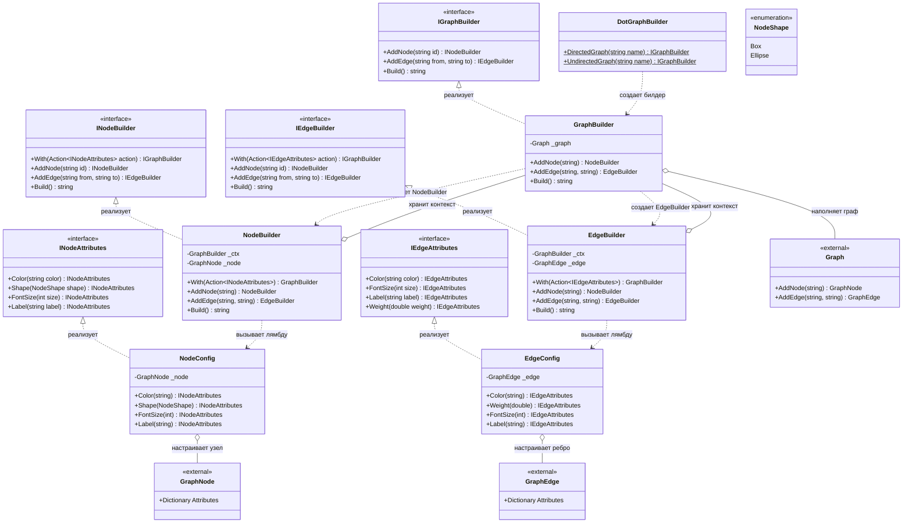

# Практика: GraphViz

## 1. Описание предметной области и сущностей
*Система реализует Fluent API для построения графов в формате DOT. DotGraphBuilder - статический класс, который создаёт граф через методы DirectedGraph и UndirectedGraph. IGraphBuilder, INodeBuilder и IEdgeBuilder управляют добавлением элементов, а INodeAttributes и IEdgeAttributes настраивают их свойства.Внутренние классы GraphBuilder, NodeBuilder и EdgeBuilder реализуют эти интерфейсы. Конфигурация выполняется через метод With, который принимает лямбду с настройками и возвращает IGraphBuilder для продолжения цепочки. Graph, GraphNode и GraphEdge хранят данные, NodeShape - формы вершин.*

## 2. Диаграмма классов (Mermaid)

