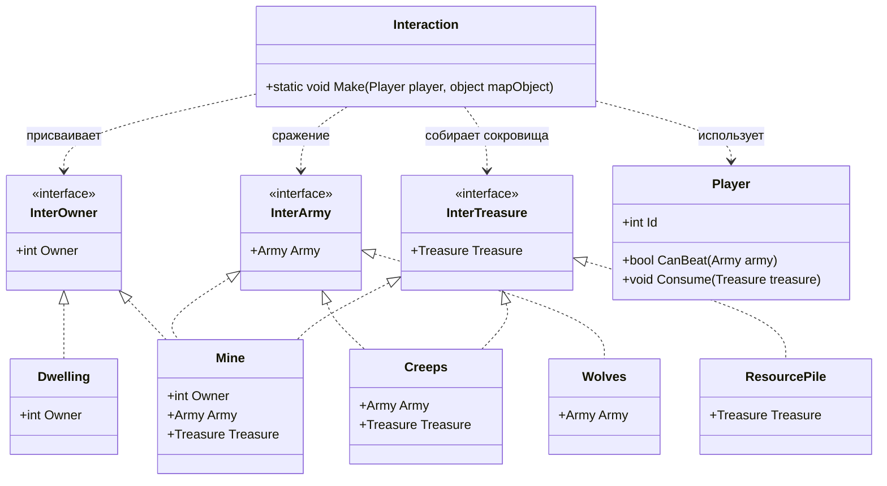

# Практика: HoMM

## 1. Описание предметной области и сущностей
*Компьютерная игра, где персонаж взаимодействует с различными объектами на карте. Реализованы интерфейсы InterOwner - владелец, InterArmy - наличие армии, InterTreasure - сокровище. Player - это игрок который может получить сокровища, как победить армию так и погибнуть в бою Dwelling - объект жилища , Mine - шахта у которой 3 роли: имеет владельца, содержит сокровища а так же охраняется армией. Creeps - монстры охраняющие сокровища. Wolves - волки, у которых есть только армия для сражения. ResourcePile - содержит только сокровища. Interaction - реализован метод Make в котором реализовано управление логикой взаимодействия в игре. Если есть сокровища игрок их забирает, если обнаружили армию то запускается сражение, а так же объект перехоит под контроль игрока если есть наличие интерфейса владельца.*

## 2. Диаграмма классов (Mermaid)

