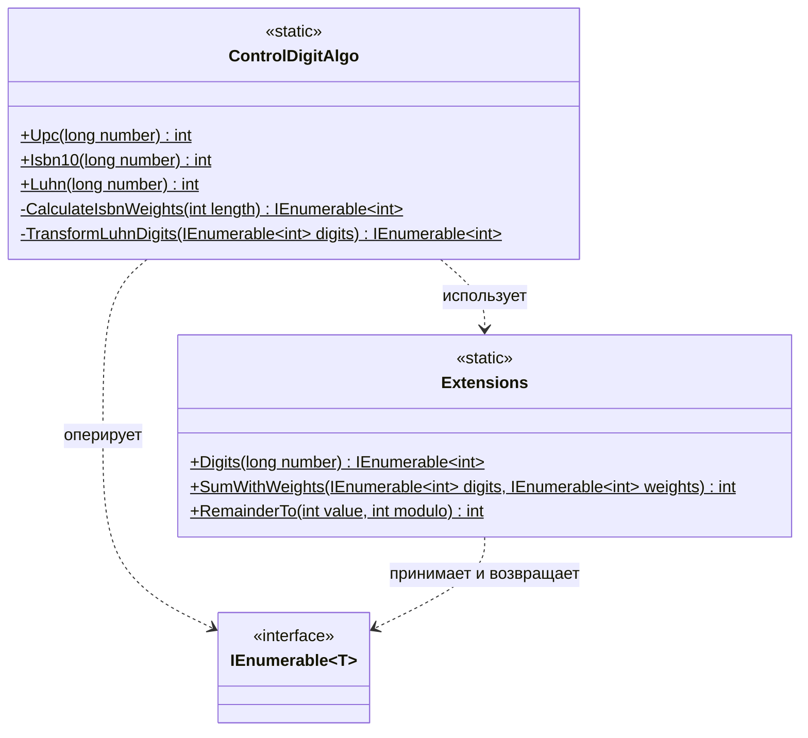

# Практика: Контрольный разряд

## 1. Описание предметной области и сущностей
Реализована система вычисления контрольных цифр для различных стандартов нумерации.
ControlDigitAlgo - основной класс содержащий публичные методы вычисления контрольных цифр по алгоритмам. Также в классе располагаются приватные методы, реализующие логику, специфичную для отдельных алгоритмов.
Extensions - вспомогательный статический класс с методами. Метод Digits преобразует число в последовательность его цифр, SumWithWeights вычисляет взвешенную сумму элементов последовательности, а RemainderTo определяет значение, необходимое для получения числа, кратного заданному модулю.
IEnumerable - интерфейс используемый для хранения и передачи последовательностей цифр между методами алгоритмов и вспомогательными функциями. 

## 2. Диаграмма классов (Mermaid)

