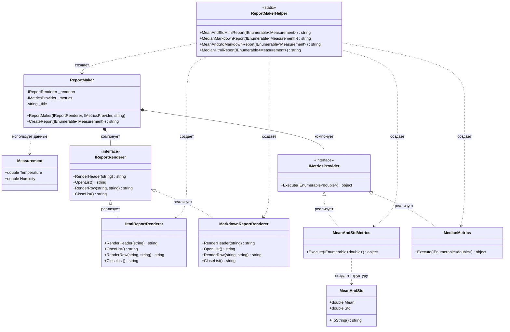

# Практика: Генератор отчетов

## 1. Описание предметной области и сущностей
В системе моделируется гибкий генератор статистических отчетов о погодных измерениях. Она принимает набор измерений температуры и влажности за несколько дней, вычисляет выбранные статистические показатели и оформляет результат в одном из двух форматов HTML или Markdown.

Measurement - хранит данные одного измерения: температуру воздуха и влажность. 
MeanAndStd - вспомогательный класс который содержит результат вычислений средней температуры и стандартного отклонения.
IMetricsProvider - интерфейс который задает правила для всех классов, отвечающих за вычисление статистики.
HtmlReportRenderer - оформляет отчет в формате HTML.
MarkdownReportRenderer - оформляет отчет в формате Markdown.
MeanAndStdMetrics - принимает список чисел, вычисляет их среднее арифметическое и стандартное отклонение.
MedianMetrics - принимает список чисел, сортирует их и находит медиану.
ReportMaker - основной и главный класс который собирает готовый отчет. В конструктор получает оформитель, вычислитель и заголовок будущего отчета. 
ReportMakerHelper - спомогательный класс который предоставляет готовые методы для получения всех четырех типов отчетов.

## 2. Диаграмма классов (Mermaid)

