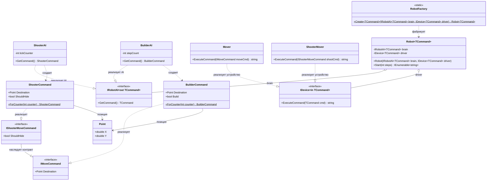

# Практика: Роботы

## 1. Описание предметной области и сущностей
* Реализуется система управления роботами. У робота есть две основные части:
AI (искусственный интеллект) - мозг робота, который генерирует команды.
Device (устройство) -исполнитель, который выполняет эти команды. 

IRobotAI<out TCommand> - интерфейс ИИ, генерирующий команды.
IDevice<in TCommand> - интерфейс устройства, выполняющий команды.
IMoveCommand и IShooterMoveCommand - интерфейсы команд.
ShooterAI, BuilderAI - конкретные ИИ.
Mover, ShooterMover - конкретные устройства.
Robot<TCommand> - сам робот, объединяющий AI и Device.
Robot - статическая фабрика для удобного создания роботов.
Point - хранит координаты X и Y на карте.*

## 2. Диаграмма классов (Mermaid)

