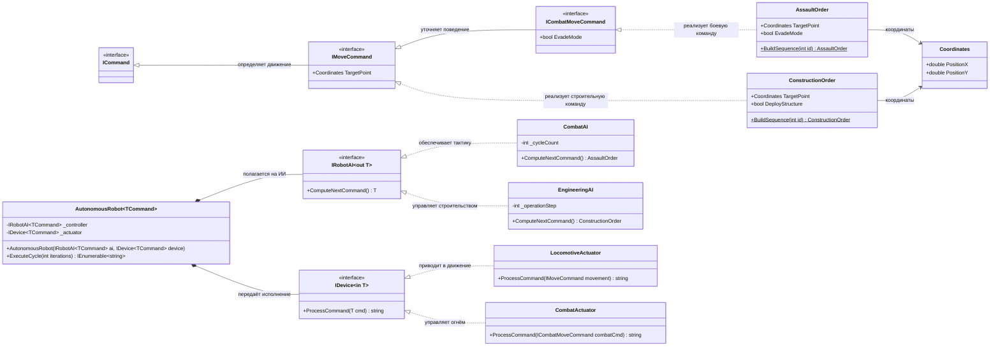

# Практика: Роботы

## 1. Описание предметной области и сущностей
* Реализуется система управления роботами. У робота есть две основные части:
AI (искусственный интеллект) - мозг робота, который генерирует команды.
Device (устройство) -исполнитель, который выполняет эти команды. 
ICommand - базовый интерфейс для любых действий.
IMoveCommand - интерфейс команды перемещения, содержит целевую точку.
ICombatMoveCommand - интерфейс боевой команды, расширяет перемещение флагом уклонения.
IRobotAI<out T> - интерфейс ИИ с ковариантным параметром, генерирует команды.
IDevice<in T> - интерфейс устройства с контрвариантным параметром, выполняет команды.
CombatAI, EngineeringAI - конкретные ИИ для боевых и строительных задач.
LocomotiveActuator, CombatActuator - конкретные устройства для перемещения и боя.
AutonomousRobot<TCommand> - основной класс робота, объединяющий AI и Device.
AssaultOrder, ConstructionOrder - классы данных с параметрами конкретных команд.
Coordinates - хранит координаты X и Y на карте.

## 2. Диаграмма классов (Mermaid)

