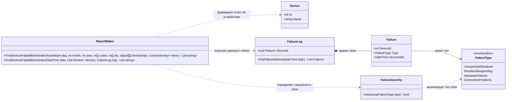

# Практика: Сбои

## 1. Описание предметной области и сущностей
В системе ведётся учёт устройств, на которых произошли сбои до определённой даты. 
Device хранит информацию об устройстве. 
FailureType содержит возможные типы сбоев. 
Failure представляет информацию о конкретном сбое устройства, тип и дату возникновения.
FailureLog отвечает за хранение и предоставление сведений о зарегистрированных сбоях. Класс FailureSeverity определяет, является ли определёный тип сбоя критическим.
ReportMaker он получает информацию об устройствах и зарегистрированных сбоях, использует FailureLog для доступа к данным о сбоях и FailureSeverity для определения их критичности. После этого формируется список устройств, на которых произошли критические сбои до заданной даты

## 2. Диаграмма классов (Mermaid)

