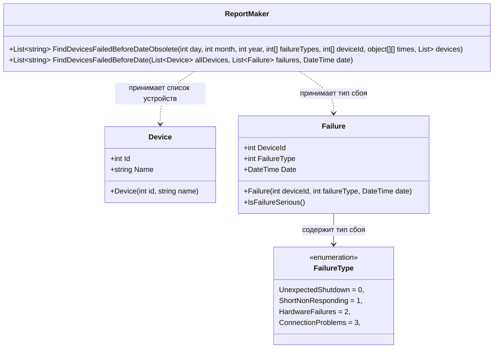

# Практика: Сбои

## 1. Описание предметной области и сущностей
В системе ведется учет об устройствах на которых произошел сбой до определенной даты. Device хранит информацию об устройстве, FailureType хранит тип сбоя, Failure хранит в себе информацию о сбое в конкретном устройстве, ReportMaker является основным классом который принимает список устройств и список сбоев, затем определяет на каких устройсвах были критические сбои до определенной даты и затем фиксирует данный устройства.

## 2. Диаграмма классов (Mermaid)

